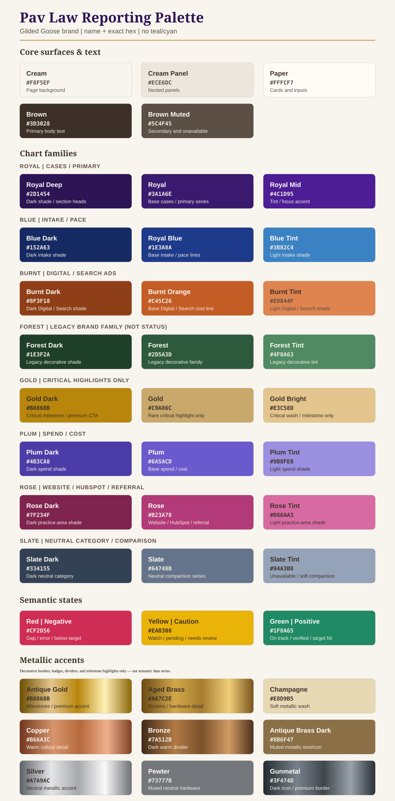
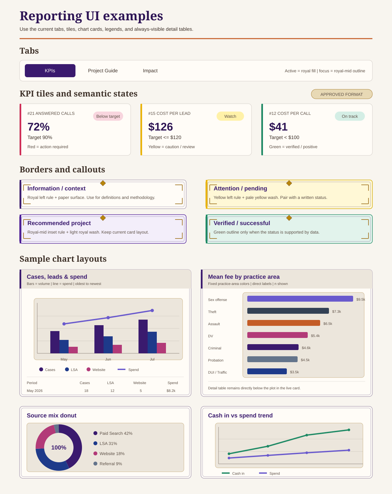

# Pav Law Reporting — Brand & Color Guide

Companion to [BRANDING-LAYOUT.md](BRANDING-LAYOUT.md) (canonical token hub). This doc focuses on the **KPI reporting** surface only: color coding with examples, the expanded GGL shade ramp for multi‑series charts, and a catalog of **every reporting table**.

**Built from the live page** — do not guess:
- Guide tokens: `index.html` `:root` + `BRANDING-LAYOUT.md` §3/§6
- Charts & tables: `kpi-report.js` (`chartBlock()`, `kpiDetailTable()`)
- Value icons: `index.html` `:root` `--vi-*`

**Rule:** GGL brand is the source of truth for Pav reporting. **No teal/cyan.** When the live Guide palette changes, edit `index.html` tokens + [BRANDING-LAYOUT.md](BRANDING-LAYOUT.md) + `.cursor/rules/pav-law-kpi-charts.mdc` in the same PR, then reflect here.

---

## 1. Color coding by meaning

The locked meaning for each color. Same series keeps the same color in every chart, legend, table accent, and KPI tile.

| Meaning | Hex | Token |
|---|---|---|
| Cases / new matters / primary series | `#3a1a6e` | `--gg-royal` / `--gg-series-1` |
| Intake / LSA / pace lines | `#1e3a8a` | `--gg-royal-blue` |
| Digital ads / Search media / cost lines | `#c45c26` | `--gg-burnt` (line, not bar) |
| Website / HubSpot forms / tertiary series | `#b23a78` | rose / pink |
| Critical highlight only (CTA / milestone) | `#e3c58d` | `--gg-gold-bright` — do **not** use for scores, ranks, or table chrome |
| Spend / cost (money key) | `#6a5acd` | spend swatch |
| Cash in / target hit | `#1f8a65` | `--gg-positive` |
| Negative value / gap / below target | `#cf2d56` | `--gg-negative` |
| Caution / watch / pending review | `#eab308` | `--gg-caution` (new reporting semantic) |
| Neutral / unavailable | `#5c4f45` | `--gg-brown-muted` |

**Semantics:** use red / yellow / green only for negative / caution / positive states — never for arbitrary chart series, table columns, fees, priorities, totals, missing data, or decorative progress bars. Never communicate by color alone; always keep the written status, icon, or legend.

**Percentage-change labels:** use black, regular-weight text in the consistent `↑ +N%` / `↓ −N%` format. Do not color or bold percentage-change labels.

### Surface contrast

Paper must read as a card placed **on** the cream panel, not as the same color.

| Layer | Hex | Use |
|---|---|---|
| Page cream | `#f8f5ef` | Overall page background |
| Cream panel | `#ece6dc` | Section wells, nested panels, chart headers |
| Paper | `#fffcf7` | Cards, tiles, tables, inputs |
| Nested panel | `#e6dfd4` | Deeper inset only; use sparingly |
| Primary text | `#3d3028` | Headlines and body |
| Secondary text | `#5c4f45` | Labels, captions, source notes |

---

## 2. Expanded shade ramp (more colors, same families)

For charts with **more than 4 series**, extend each brand family into tints/darks instead of introducing new hues. This keeps "more colors and shades" on‑brand and teal‑free.

| Family | Dark | Base | Tint | Use order for stacks |
|---|---|---|---|---|
| Royal (cases/primary) | `#2d1454` | `#3a1a6e` | `#4c1d95` | 1st, 4th, 7th series |
| Blue (intake) | `#152a63` | `#1e3a8a` | `#3b82c4` | intake / secondary volume |
| Burnt (Digital/Search ads) | `#8f3f18` | `#c45c26` | `#e0844f` | 2nd, 5th series |
| Positive state (not categorical) | `#166a4c` | `#1f8a65` | `#4fb58f` | Target hit / cash in only |
| Gold (critical highlight only) | `#b8860b` | `#c9a86c` | `#e3c58d` | CTA, milestone, or premium accent — never default chrome |
| Plum (spend) | `#4b3ca8` | `#6a5acd` | `#9b8fe0` | spend / cost only |
| Rose (practice/referral) | `#7f234f` | `#b23a78` | `#d86aa3` | practice area / referral |
| Slate (neutral category) | `#334155` | `#64748b` | `#94a3b8` | comparison / unavailable |

Rules for the ramp:
- Keep adjacent stack segments from two **different** families (no two near‑identical purples touching).
- Darkest shade = oldest / lowest; tint = newest / on top — consistent per chart.
- Semantic red/yellow/green never enter the categorical ramp.
- Categorical charts and tables use royal, blue, burnt orange, rose, plum, and slate only. **Gold is not a category.**

### Metallic accent palette

Metallics are decorative accents, not semantic or categorical data colors.

| Metallic | Base hex | Use |
|---|---|---|
| Antique Gold | `#b8860b` | Critical milestones / premium CTA only |
| Aged Brass | `#a67c2e` | Borders, hardware details, small icons |
| Champagne | `#e8d9b5` | Soft metallic wash behind a badge or label |
| Copper | `#b66a3c` | Warm callout detail |
| Bronze | `#7a512b` | Dark warm divider or icon |
| Antique Brass Dark | `#8b6f47` | Muted metallic text/icon |
| Silver | `#a7a9ac` | Neutral metallic accent |
| Pewter | `#73777b` | Muted neutral hardware |
| Gunmetal | `#3f474d` | Dark premium border or icon |

- Metallic gradients are allowed only on rare critical CTAs, completion seals, and milestone accents.
- Charts and table swatches use the **flat base hex**, never a metallic gradient.
- Do not use metallics for red/yellow/green status meaning.

---

### Practice-area color example

Practice areas keep one fixed color in every chart and matching table swatch:

| Practice area | Color | Hex |
|---|---|---|
| Sex Assault / Sex Offense | Plum | `#6a5acd` |
| Theft / Property | Slate Dark | `#334155` |
| Assault / Menacing | Burnt Orange | `#c45c26` |
| Domestic Violence / DV | Rose | `#b23a78` |
| Criminal Defense (other) | Royal | `#3a1a6e` |
| Probation Revocation | Slate | `#64748b` |
| DUI / DWAI / Traffic | Royal Blue | `#1e3a8a` |

---

## 3. Semantic states — red / yellow / green

| State | Hex | Border / fill example | Use |
|---|---|---|---|
| Negative / action required | `#cf2d56` | red left border + pale red wash | Below target, error, negative delta, missed opportunity |
| Caution / watch | `#eab308` | yellow left border + pale yellow wash | Pending, near threshold, review needed, WIP |
| Positive / verified | `#1f8a65` | green outline/left border + pale green wash | On track, verified, target reached, cash in |

- Pair every state color with a written label: **Below target**, **Watch**, or **On track**.
- Use dark brown text on yellow; white or paper text on full red/green fills.
- Do not use semantic colors as practice-area or channel categories.

---

## 4. Money semantics

Two money meanings must stay visually distinct when shown. Do not add a standalone key above the Project Outlines table:

| Swatch | Meaning | Hex |
|---|---|---|
| Spend waste | cash already paid out | `#6a5acd` |
| Missed opportunity | potential revenue not earned | `#cf2d56` |

---

## 5. Value icon palette (reference)

One map only — filter tiles + Project Outlines ICONS share `.value-icon.icon-{id}` (`--vi-*` in `index.html`). Full table in [BRANDING-LAYOUT.md §7](BRANDING-LAYOUT.md#7-value-icon-color-map). Do not fork a second palette.

---

## 6. Borders, callouts, and formatting

### Border styles

| Component | Border | Surface | Formatting |
|---|---|---|---|
| Default tile/card | `1px rgba(61,48,40,.22)` | Paper `#fffcf7` | 8px radius |
| Section/split panel | `1.5px rgba(45,20,84,.38)` | Paper | 10–12px radius; restrained shadow |
| Active/selected | `1.5px #3a1a6e` + 2px royal wash ring | Paper/royal wash | Preserve current tile size |
| Recommended project | 4px left `#4c1d95` | `#f3eefa` | Royal-mid label |
| Information/context | 4px left `#3a1a6e` | Paper | Definition or methodology |
| Attention/pending | 4px left `#eab308` | `#fff8d6` | Must say **Watch** or **Pending** |
| Verified/success | 4px left or outline `#1f8a65` | `#e2f3ec` | Data-backed only |
| Negative/action | 4px left `#cf2d56` | `#f8d5de` | Must name the gap/error |
| Ornate callout | Aged-brass outer line + thin royal inner line + small gold corner brackets/diamond | Semantic wash or paper | Reserve for a critical recommendation or milestone only |

### Formatting rules

- Keep the existing **KPIs / Project Guide / Impact** tabs and current tile grid.
- Active tab = royal fill; inactive tabs remain paper with dark text.
- KPI tile hierarchy: ID/label → large value → target/context → status.
- Section heads: solid royal-deep background, white title, lavender hint, and burnt left rule. Do not use gradients or pale washes for KPI section headers.
- Rank / project-score columns and sort controls: royal purple (`--gg-royal`), not gold or forest green.
- Callouts use a semantic left rule, light wash, aged-brass outer line, thin royal inner line, and restrained corner ornament; no full-layout recolor.
- Default shadow: `0 1px 4px rgba(45,20,84,.08)`. No heavy floating-card shadows.
- Headline text: royal-deep or brown, weight 700–800. Body and captions remain visibly smaller.
- Corners: 8px for tiles/callouts; 10–12px for section panels.

### Approved gold placements

Gold is intentionally rare. In the live Guide it is limited to:

- The primary **Review Plan / continue** CTA.
- Completion or celebration milestones (completed badge, thank-you state, success confetti).
- The premium **Why Gilded Goose** frame.
- The critical **Solutions** recommendation callout.

Everything else — default cards, chart categories, ranks, scores, selected rows, form focus, table totals, headings, and ordinary badges — uses royal purple or the applicable semantic color.

### KPI tile format — approved

Approved 2026-07-18. Keep the tile proportions and information hierarchy shown in `reporting-components-examples.svg`:

1. KPI ID + uppercase label
2. Large primary value
3. Target/context line
4. Written semantic status badge
5. Matching 5px red/yellow/green left rule

Team Goals tiles use exactly three tracking rows. Each row is `3.25rem` high with vertically centered cells so the three tiles align.

Do not redesign the tile layout; future changes are color, typography, border, or spacing refinements only.

---

## 7. Sample graph and chart layouts

### Layout rules

- **Bar chart:** direct value labels; baseline visible; newest period first.
- **Line chart:** use for spend/cash trends; cash = green, spend = plum; label both lines.
- **Combo chart:** bars for volumes, line for money; separate left/right units.
- **Donut:** maximum 4–5 segments; legend always present; exact share in the detail table.
- **Practice-area bars:** one fixed color per practice area; never recolor by rank.
- **Every chart card:** title + period/source caption + plot + always-visible detail table. Add a legend only for 2+ distinct series that are not directly labeled; opacity-only forecast states belong in the caption/table.
- **Plot area:** warm cream-panel background `#ece6dc` with a thin aged-brass border; keep the surrounding chart card paper `#fffcf7`.
- **Chart border:** thin royal inner line plus aged-brass accent details; ornament must not compete with labels or data.
- **Axis labels:** include metric and unit; never rely on color alone.
- **Channel lock:** LSA = blue; Digital/Search = burnt orange; Website/HubSpot = rose; Spend = plum.
- **Unavailable data:** slate/gray with a written “No data” label — never red.
- **Target lines:** every plotted number below its applicable target or minimum line is red (`--gg-negative`); values on or above the line keep their assigned nonnegative color. Keep the number visible so color is not the only signal.
- **Half-moon gauges:** show only the numeric value at the inside base of the arc. Do not place descriptive text or target captions inside or beneath the gauge; put that context in the adjacent title/stat block.
- **Gauge scales:** both endpoint labels use the same black text (`#111`) regardless of progress or target state. A success state may recolor the arc and center value, never the scale.
- **Gauge goal marks:** use an unlabeled tick. Explain the goal in the adjacent stats rather than on the gauge.

---

## 8. Reporting table catalog

Every table rendered by `kpiDetailTable()` / section in `kpi-report.js`, with its column headers. All tables: zebra rows, right‑aligned numeric columns, current month first where a period axis exists.

### Pipeline & cases

| Section | Headers |
|---|---|
| Cases MoM | Month · Closed · New cases · Red accounts · Total · MoM notes |
| Cases, Leads & Spend | Period · Cases · LSA calls · Digital ad calls · Website forms · LSA media · Search media |
| Cases forecast | Month · Cases · Status |
| Mean fee by practice area (#29) | Practice area · n · Mean fee |
| Avg deposit | Measure · Amount |

### Lead channels & source

| Section | Headers |
|---|---|
| Leads by channel (stacked) | Lead type · [months…] · % vs Jun · Jun spend |
| Stacked series detail (generic) | [series] · May · Jun · Δ · Change · Spend |
| Source mix | Source · Leads · Share · Est. potential revenue |
| Source mix — month comparison | Source · Prior · Current · Δ leads · Change |
| Search calls by campaign | Campaign · Calls · Share |

### Spend efficiency

| Section | Headers |
|---|---|
| LSA vs Digital advantage | Metric · Digital (observed) · At LSA rate · Advantage |
| LSA charge rate | Period · LSA leads · Charged · Charge rate · LSA media · LSA media / charged lead |
| Divert from LSA | Divert from LSA · → Consulting · → Digital ads · Consulting % · Media % · All‑in $/call · Decision |
| Channel compare | Channel · June media · Consulting · Calls · All‑in $/call |
| Missed revenue | Measure · Value · Notes |

### Financials & trust

| Section | Headers |
|---|---|
| Cash collected MoM | Month · Cash collected · New cases · Cash / new case |
| Cash arrives (projection) | Cash arrives · Projected cash‑in · From prior cohorts · From new intake · Notes |
| Cohorts | Signing month · New cases · Billed · Collectible (80%) |
| Run‑rate | Steady‑state intake · Monthly cash‑in |
| Mid‑year checkpoints | Checkpoint · Target / expense · Actual or forecast · Gap · Status |
| Trust applications | Window · Trust applications · Ledger rows |
| Trust snapshot | Client trust snapshot · Value |

### Recommendations

| Section | Headers |
|---|---|
| Projects for a KPI | Project · Priority / status · Fee · Role in recommendation · Success gate |

---

## 9. Table styling rules

- **Structure:** every chart card uses `chartBlock()` — plot + legend (2+ series) + detail table always visible below (not hidden behind "Show table").
- **Zebra:** `.kpi-chart-table tbody tr:nth-child(even)` soft royal wash `rgba(45,20,84,0.035)`.
- **Headers:** `.kpi-table th` royal (`--gg-royal`), left‑aligned; numeric columns right‑aligned.
- **Verification:** red **✕** = unverified; green outline = export‑backed (no star).
- **Time order:** current (newest) month first, then backward — label the axis direction.
- **Categorical cells:** royal, blue, burnt orange, rose, plum, or slate only. Gold is reserved for critical highlights, never an ordinary category.
- **Fees and totals:** plum or royal; do not use green unless the value explicitly means cash received or a positive result.
- **Missing/unavailable:** slate/gray; red is reserved for an actual error, gap, loss, or below-target state.

---

## 10. Example

Golden Goose KPI → recommended projects screen (headline hierarchy + on‑brand palette):

---

## 11. Do / don't (reporting)

**Do**
- Extend brand families into shades for extra series.
- Keep one color = one meaning across chart, legend, table, tile.
- Reserve red/yellow/green for negative/caution/positive only.
- Keep gold for **critical** highlights only (primary CTA, rare milestone). Default ranks, scores, and table accents use royal purple.

**Don't**
- Introduce teal/cyan (`#00d4c4`, `#2dd4bf`, peacock teal).
- Put two near‑identical purples on adjacent stack segments.
- Use semantic red/yellow/green as arbitrary chart categories.
- Fork a second palette in `app.js`, `projects-data.js`, or markdown.
