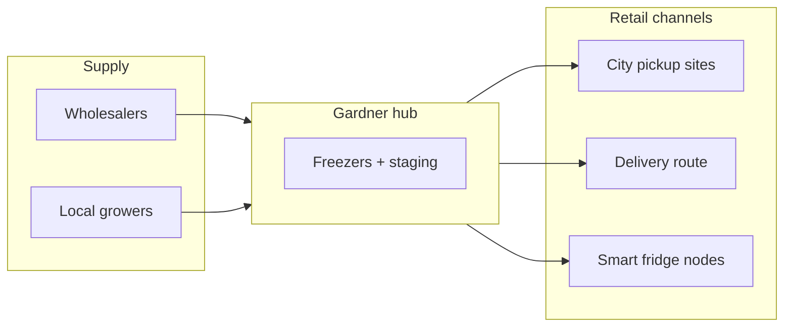

# Mobile grocery & community food plan

**Entity (retail):** Gilded Goose LLC · **Charity (starting now):** own 501(c)(3) + fiscal sponsor · **Pickup site:** Raymond Aguirre Community Center, Gardner  
**Updated:** 2026-07-04 · **Master doc:** [GRANT-GOOSE-MASTER.md](GRANT-GOOSE-MASTER.md) · **Prep:** [MOBILE-GROCERY-PREP-SEQUENCE.md](MOBILE-GROCERY-PREP-SEQUENCE.md) · **Charity/sites:** [CHARITY-AND-PICKUP-SITES.md](CHARITY-AND-PICKUP-SITES.md) · **Backend ops:** [MOBILE-GROCERY-BACKEND-OPS.md](MOBILE-GROCERY-BACKEND-OPS.md)

---

## 1. What this is (one paragraph)

Gilded Goose runs a **rural wholesale-to-retail cold chain**: buy staples at wholesale, stage cold inventory at an **approved street address** (see §1a), sell through **pickup at Raymond Aguirre Community Center** (Gardner), **delivery**, and later **smart fridges**. Partner charity (**501(c)(3)**) accepts donations and funds subsidized food. Not candy vending — healthy staples for LILA Huerfano County.

---

## 1a. Address problem (no house on land)

**Huerfano County Land Use:** addresses are assigned to **completed homes**, not vacant 36 ac. Kate has **no Gardner street address** and is **not building a house**.

| What works | What does not |
|------------|----------------|
| **Raymond Aguirre Community Center** — 28 County Road 632, Gardner 81040 | PO box as operating / SNAP store address |
| County **permission letter** for pickup + storage on site | Virtual mailbox as USDA FNS location |
| Walsenburg **registered agent** street for mailing / SOS | Assuming parcel legal description = retail license address |
| Reefer trailer / freezers **on site with county OK** | Cold hub on land without address **until** county confirms a permitted structure |

**Contact:** Lester Berry · [recreation@huerfano.us](mailto:recreation@huerfano.us) · Huerfano County **719-738-3000**

**Optional later:** permitted non-habitation cold building on your land — ask Land Use if that can get an E911 address without a dwelling.

## 2. How it works (operating model)

### Phase 0 — Prove demand (now → Sep 2026, ~$0–500)

| Step | What | Who / where |
|------|------|-------------|
| 0.1 | **Pre-order catalog** — SKUs **after wholesaler calls** (Step 3 in prep sequence) | FOOD-07 |
| 0.2 | **Pickup windows** at **Raymond Aguirre Community Center**, 28 CR 632, Gardner | County permission via Lester Berry |
| 0.2a | **Two order tiers:** **Standard pickup** (SNAP-friendly staples, lower price) · **Custom/delivery** (wider SKU, higher price, delivery fee TBD) | Profile Round 2 #4 |
| 0.3 | **Delivery route** — optional paid delivery fee for Gardner / La Veta corridor | Your vehicle first; reefer later |
| 0.4 | **Track metrics** — orders/week, ZIPs, SNAP interest | Feeds OP-01 LOE + grant narratives |
| 0.5 | **MarketLink SNAP reader** for staffed pickup (**FOOD-02**) | Free EBT hardware while unattended SNAP is pending |

**Revenue:** Retail price = wholesale cost + margin (15–35% on staples) + optional delivery fee.  
**Not in Phase 0:** Multiple smart fridges, reefer truck, full SNAP unattended.

### Phase 1 — Licensed hub + cold storage (Oct–Dec 2026, OP-01 purchases)

| Step | What | Equipment (FOOD ID) |
|------|------|---------------------|
| 1.1 | **DOR sales tax** #96288442 ✅ then **retail food license** — Gardner hub (GG-037) | DOR before LA-H · plan review $155 + license (see §8) |
| 1.2 | **Commercial freezers** at Gardner outbuilding | FOOD-14 |
| 1.3 | **Generator** for SIEA outages | FOOD-10 |
| 1.4 | **SNAP/WIC POS** at staffed pickup | FOOD-11 |
| 1.5 | **USDA FNS retailer authorization** — one license per **fixed pickup address**; update for each new node | FOOD-01 |
| 1.6 | **First smart fridge node** (optional in Dec batch) | FOOD-13 |

**Weekly rhythm (target):**

1. **Monday** — Wholesale order cutoff (Andrews Pueblo / Valley Roots — see §4).
2. **Wednesday** — Receive delivery to **CR 632 Gardner** or pick up in **Pueblo**.
3. **Thursday** — Stage at approved site; pack pickup totes.
4. **Friday–Saturday** — Pickup windows + delivery run.
5. **Smart node** — Restock 2–3×/week when live.

### Phase 2 — Scale nodes (2027, after tax credit cash)

| Step | What |
|------|------|
| 2.1 | Used reefer trailer or box truck — **parked selling**, not rolling store (**FOOD-08**, **FOOD-22**) |
| 2.2 | Second pickup city (Pueblo South, La Veta, Trinidad corridor) |
| 2.3 | Local grower consignment (**FOOD-05**) |
| 2.4 | Trading post shelf for barter/consignment (**FOOD-18**) |



---

## 3. Competition (who you’re compared to)

### Full grocery (baseline — not your duplicate)

| Competitor | Location | Hours / notes | Your gap to fill |
|------------|----------|---------------|------------------|
| **Safeway** | 222 W 7th St, Walsenburg | 7am–9pm daily | **20+ mi** from Gardner; prices + limited rural access |
| **First Choice Market** | 801 Walsen Ave, Walsenburg | Grocery + deli/pizza | Same — hub city only |
| **Dollar General** | 124 W 7th St, Walsenburg | Convenience | Snacks/staples, not full healthy basket |
| **Loaf ‘N Jug / 7-Eleven** | Walsenburg | Convenience | No produce focus |

### Food assistance (partner — don’t compete)

| Program | Location | Schedule | Relationship |
|---------|----------|----------|--------------|
| **Dorcas Circle Food Pantry** | 911 S Main St, Walsenburg | Tue & Fri 10–3 | **Partner** — refer clients; donate via charity (§6) |
| **Huerfano County TEFAP** | 928 Russell St, Walsenburg | 2nd Tue ~10:30 | Care & Share pipeline |
| **Gardner Care & Share** | Sacred Heart parish hall, Gardner | Periodic (check bulletin) | **Key partner** — already serves Gardner; coordinate don’t duplicate |
| **La Veta Village food box** | La Veta area | Monthly | Care & Share partner |
| **Commodities 60+** | 928 Russell St | 2nd Wed monthly | Separate audience |

### Indirect / future

| Type | Notes |
|------|--------|
| **Farmers markets / farm stands** | Seasonal; you add **year-round cold chain** |
| **Amazon / Walmart delivery** | Spotty in rural Huerfano; you win on **local pickup + SNAP in field** |
| **Restaurant suppliers** | Shamrock-style — your **wholesale source**, not competitor |

**Positioning sentence (use on forms):**  
*Gilded Goose fills the gap between emergency pantry food and a 40-mile grocery trip — wholesale-priced healthy staples via pickup, delivery, and 24/7 unattended nodes in LILA tracts.*

---

## 4. Wholesalers & supply — discover before SKUs

**Order of operations:** Call wholesalers → get catalogs/prices → **then** pick staple SKUs. See `MOBILE-GROCERY-PREP-SEQUENCE.md` Step 3.

### Tier 1 — Call first (Pueblo ~55 mi from Gardner)

| Supplier | Location | Min / access | Phone |
|----------|----------|--------------|-------|
| **Andrews Foodservice** | 717 E Industrial Blvd, **Pueblo** | Broadline — ask retail/mobile account | **719-543-3846** |
| **Valley Roots Food Hub** | Pueblo + Mosca SLV | **$250** min · weekly delivery incl. Pueblo | **719-206-2839** |

### Tier 2 — Fill gaps

| Supplier | Location | Notes |
|----------|----------|-------|
| **Shamrock FSW** | **Colorado Springs** (1045 N Academy) — **~95 mi, NOT Pueblo** | Public wholesale, no membership · 719-637-5137 · only if Pueblo cannot supply a category |
| **Safeway Walsenburg** | 222 W 7th | Price benchmark only |

**There is no “Shamrock loop.”** Shamrock is a separate **Springs** trip. Your default wholesale city should be **Pueblo** (Andrews + Valley Roots), not Springs.

### Tier C — Local producers (margin + grant narrative)

| Approach | Action |
|----------|--------|
| **Huerfano / SLV growers** | 2–3 consignment partners — eggs, honey, seasonal produce (**FOOD-05**) |
| **Iowa Ave / Local Foods Local Places** | Huerfano qualifies for CDA CFA programs — network intro | Contact via county / [CDA CFA](https://ag.colorado.gov/markets/markets-funding/community-food-access-program) |
| **Care and Share** | **Not a wholesaler** — donation + partnership channel only | Agencies@careandshare.org · 719-528-1247 |

### Wholesale shopping rules for OP-01

- Keep **invoices** per equipment-related purchase and **food cost spreadsheets** separately.
- **Healthy staples ≥70%** of SKUs for OP-01 narrative and smart-fridge vendors.
- Document **Safeway vs your pre-order price** on 10 common items for “lower prices” essay.

---

## 5. Local companies & orgs to reach out to

Use this as a call list. Goal: **host sites**, **referrals**, **letters of support**, not competing with pantries.

### Priority 1 — Food access & trust

| Org | Why | Ask |
|-----|-----|-----|
| **Gardner Care & Share** (Sacred Heart) | Already serves Gardner | Co-host pickup after pantry day; referral flyer; **not** duplicate free food |
| **Dorcas Circle Food Pantry** | 911 S Main — largest Walsenburg pantry | Partner for paid affordable staples + **charity donations** (§6) |
| **Care and Share** (regional) | 293 partner agencies | Explore **partner agency** status for donated inventory route |
| **Spanish Peaks Regional Health Center** | Community resource list | Clinic waiting room as pickup host? WIC overlap |
| **Huerfano County Social Services** | SNAP/WIC enrollment | 121 W 6th St — cross-refer; Gardner delivery gap story |
| **WIC — Huerfano** | 119 E 5th St | WIC-eligible inventory at pickup |

### Priority 2 — Pickup hosts (corridor partners)

| Type | Examples to probe | Ask |
|------|-------------------|-----|
| **Churches** | Sacred Heart Gardner, Walsenburg churches | 2-hour weekly pickup; electricity for smart fridge later |
| **Community centers** | Huerfano Community Center, 928 Russell | After-hours locker or pickup window |
| **Health / clinic** | Spanish Peaks, La Veta clinic | Staffed pickup + SNAP (**FOOD-02**) |
| **Libraries / museums** | Walsenburg library, art spaces (candy machine hosts) | Flyer + pickup pilot |
| **HCED / Jump-Start** | Huerfano economic dev | Rural Jump-Start (GG-023) if export/jobs angle |
| **San Isabel Electric (SIEA)** | 719-738-1402 | Outage data for generator narrative; community board |

### Priority 3 — Supply & grants

| Org | Why |
|-----|-----|
| **CDA Community Food Access** | LOE + tax credit · cda_cfa@state.co.us |
| **Local Foods Local Places / SLV coalition** | Iava Williams presentation to county — Huerfano eligible |
| **MarketLink** | Free SNAP equipment for markets |
| **365 Retail Markets / smart fridge vendors** | EBT-capable quotes for FOOD-13 |

### Email template (short)

```
Subject: Healthy food pickup pilot — Gilded Goose / Lazy Goose Acres

Hi [Name],

I'm Kate with Gilded Goose LLC and Lazy Goose Acres in Gardner. I'm launching a 
wholesale-to-pickup healthy staple food service for Huerfano (produce, dairy, eggs, 
bread, frozen veg) — not emergency pantry food, but affordable retail for people 
who can't always get to Walsenburg.

Would [org] be open to:
  • a 2-hour weekly customer pickup window, or
  • a referral partnership with [Dorcas / Care & Share / your clients]?

I'm applying for the state Community Food Access equipment program and can share 
a one-page plan. Happy to meet after [date].

Kate · Gilded Goose LLC · [phone] · GildedGooseLimited.com
```

---

## 6. Food charity — start now (not LATER)

Kate priority: **charity early** for donations + grant eligibility. Full detail in prep sequence Step 2.

| Path | Action |
|------|--------|
| **Now** | Apply **CNDC** fiscal sponsorship + file **CO nonprofit Articles** (name TBD) |
| **Parallel** | Gilded Goose LLC continues retail/SNAP/OP-01 under arms-length rules |
| **Partner** | Gardner Care & Share + Dorcas — coordinate, don’t duplicate free pantry |

**Nonprofit vs not-for-profit:** same thing in plain language — you need a **nonprofit corporation** with **501(c)(3)**, not an LLC, for tax-deductible donations.

---

## 7. Items 3–5 — what you can do now (with this plan)

| # | Task | Prerequisite from this plan | Next concrete step |
|---|------|----------------------------|-------------------|
| **3** | Retail food license | **Step 1:** county OK for CR 632 + health dept license type | LA-H Health **719-846-2213** · plan review **$155** |
| **4** | DIC map (OP-05) | Pickup address **28 CR 632 Gardner** (+ Walsenburg if added) | EnviroScreen late Jul · before Aug 7 |
| **5** | OP-01 LOE (Dec batch) | Wholesaler quotes + equipment quotes + LILA pin at CR 632 | access.gov LOE · not Shamrock-first |

### License type decision (ask health dept)

| Model | Likely license |
|-------|----------------|
| Pickup at **Raymond Aguirre CC**, 28 CR 632 | **Limited food / mobile / special event** — confirm with Robin/Aaron |
| Cold storage = reefer trailer on site with county letter | Equipment at licensed operating address |
| Delivery from licensed pickup base | Hub address = where license is tied |
| Unattended smart fridge at host | Separate approval + SNAP FNS per address |

---

## 8. Financial sketch (Phase 0–1)

| Item | Rough cost |
|------|------------|
| Phase 0 pre-order pilot | $200–500 working inventory |
| Pueblo wholesale run (Andrews + Valley Roots) | $300–800/trip + delivery fee if applicable |
| Plan review (health dept) | $155 |
| Grocery license (2026 fee) | ~$244 (under 15k sq ft) |
| CO sales tax license | Free registration |
| SNAP FNS authorization | Free |
| MarketLink EBT reader | Free (grant) |
| OP-01 equipment (Dec) | $25–50K → ~$6–12K net after 75% credit |

---

## 9. Decisions still needed from Kate

See **`MOBILE-GROCERY-PREP-SEQUENCE.md`** — questions in logical order only.

- [ ] Lester Berry / county — pickup + storage at **28 CR 632**  
- [ ] Charity name + **CNDC** application + board members  
- [ ] **Andrews + Valley Roots** wholesaler calls before SKUs  
- [ ] Legal last name, EIN, phone, email  

---

## 10. Suggested 30-day sequence (when fire deferral lifts)

| Week | Focus |
|------|--------|
| **1** | Call Gardner Care & Share + Dorcas · one Shamrock pricing trip · draft 20-SKU list |
| **2** | Health dept pre-consult (license type) · launch pre-order page (**FOOD-07**) |
| **3** | First pickup pilot at Gardner · log orders/ZIPs · Safeway price comparison sheet |
| **4** | Request equipment quotes (freezer, generator, SNAP POS, smart fridge) · start LOE draft |

---

*Grant Goose · editable — tell agent “update mobile grocery plan”*
