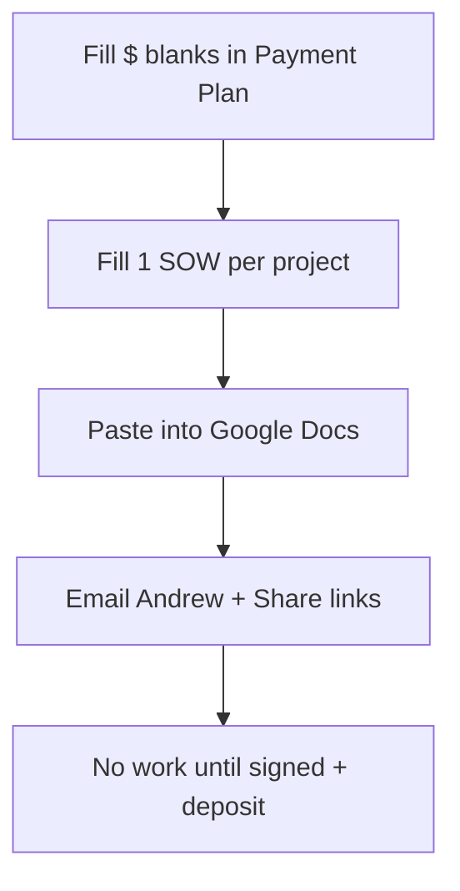

# How to send Andrew the payment plan + SOW (visual)

**Confused by the other docs?** This page is the **send order only**. Legal text lives in the two attachments.

---

## What you send (2 files + 1 menu)

| # | File | What it is |
|---|------|------------|
| 1 | [PERFORMANCE-PAYMENT-PLAN.md](PERFORMANCE-PAYMENT-PLAN.md) | Past-due schedule + monthly retainer + KPI bonuses |
| 2 | [STANDARD-SOW.md](STANDARD-SOW.md) | Contract for **each** new project (Search fix, referral, etc.) |
| 3 | [2026-06-andrew-pricing-menu.md](../../../daily/2026-06-andrew-pricing-menu.md) | Pick projects A1–A10 |

Optional cover note: [SEND-PACKAGE.md](SEND-PACKAGE.md)

---

## Before you email — fill these 5 blanks

Open **PERFORMANCE-PAYMENT-PLAN.md** and search for `$[___]`:

| Blank | Example | Your number |
|-------|---------|-------------|
| Total past-due | $10,000+ | $________ |
| Down payment | $2,000 | $________ |
| Monthly installment | $1,000 × 8 mo | $________ |
| Retainer / mo | $3,500 | $________ |
| KPI bonus cap / mo | $1,500 | $________ |

For each project he wants in July, duplicate **STANDARD-SOW.md** once and fill **§2 Deliverables** + **§5 Fee**.

---

## Send flow (3 steps)

| Step | You do | Andrew does |
|------|--------|-------------|
| **1** | Google Docs: paste Payment Plan + each SOW | — |
| **2** | Email: “Sign payment plan + SOW(s); reply with retainer yes/no and A# picks” | Reviews menu |
| **3** | Wait for signature + deposit/retainer | Signs + pays per doc |

---

## One-line email (copy/paste)

**Subject:** Pav Law — payment plan + project SOWs

Andrew — attached are (1) our **payment plan** for past-due + ongoing retainer/KPI bonuses, and (2) **SOW(s)** for [list projects]. Pick retainer and A# projects from the menu; sign and return with deposit per the SOW before new work starts. — Kate

---

## Track A vs Track B (30-second read)

| | Track A | Track B |
|---|---------|---------|
| **Pays for** | Old bills (consulting + floated costs) | New month-to-month work |
| **Structure** | Installments or lump sum | Retainer + flat KPI bonuses |
| **Not included** | — | % of legal fees or case wins |

Every **new project** still needs its own **SOW** even if he’s on retainer.

---

*Full menu: [2026-06-andrew-pricing-menu.md](../../../daily/2026-06-andrew-pricing-menu.md)*
